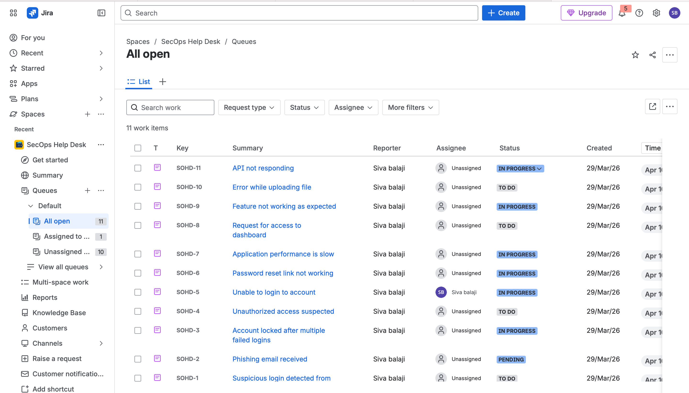
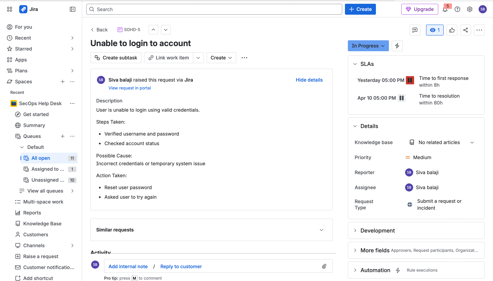
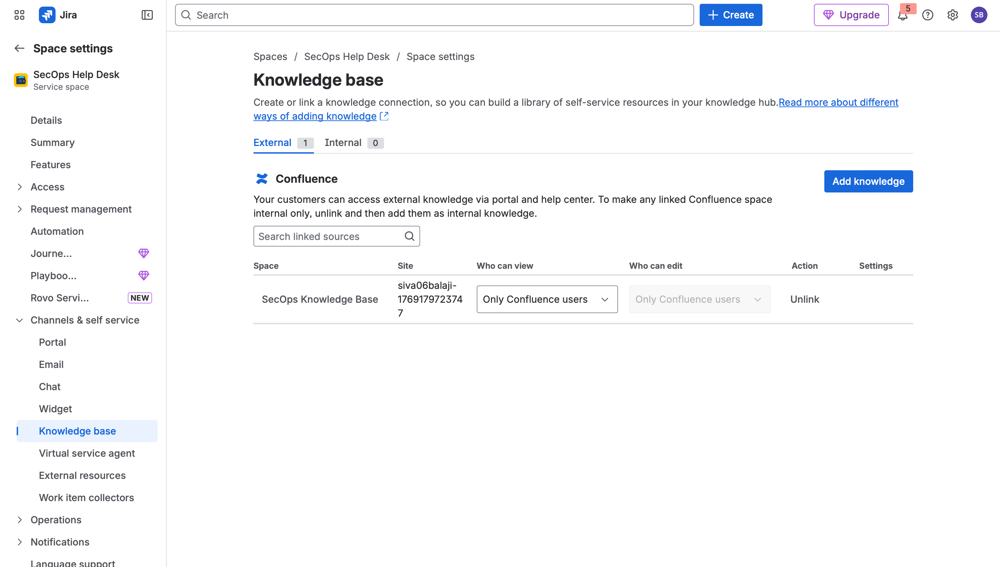
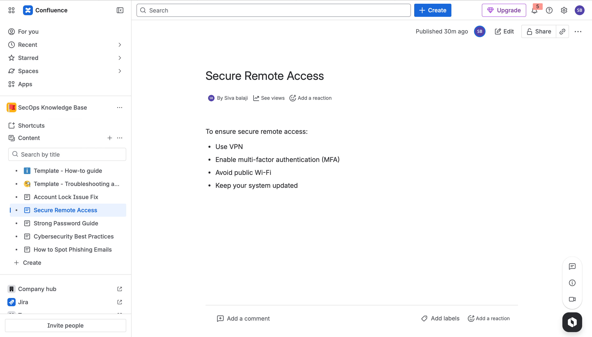

# SecOps Help Desk Project

Security-focused Help Desk project using Jira Service Management and Confluence.

---

## 📌 Features
- Incident & request management
- Ticket lifecycle (To Do → In Progress → Resolved)
- Knowledge base integration
- Security-focused issue handling (phishing, login issues)

---

## 🖼️ Screenshots

### 📋 All Tickets (Queue View)

### 🎫 Ticket Details

### ⚙️ Knowledge Base Settings

### 🔐 Secure Remote Access Article

---

## 🛠️ Tools Used
- Jira Service Management
- Confluence
- GitHub

---

## 🎯 Use Case
This project simulates a real-world IT Help Desk system handling:
- Login issues
- Security incidents
- Phishing emails
- Access requests

---

## 📹 Demo
(Add your demo video link here)Security-focused Help Desk project using Jira Service Management and Confluence
